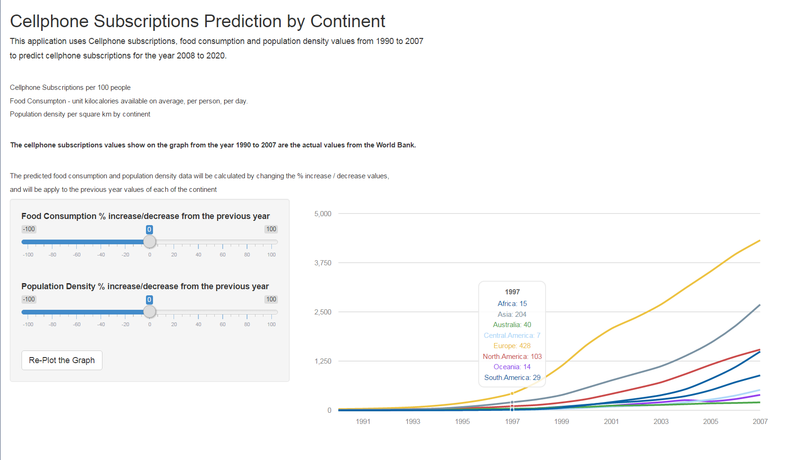

Predicting Cellphone Subscriptions by Continent
========================================================
author: Ajil
date: 2016-04-30  
transition : linear
font-family: Times

<small>
Coursera Data Science Course  
Developing Data Products class
</small>

Overview
========================================================
This application uses cellphone subscriptions data, food consumption data, 
and population density data from 1990 to 2007 to predict cellphone subscriptions of each continents 
for year 2008 to 2020.

<small>
Data Description and Source
- Cellphone subscriptions from World Bank, are subscriptions to a public mobile telephone 
services using cellular technology. Post-paid and pre-paid subscriptions are included. Unit per 100 people.
- Food Consumption from Food and Agriculture Organization, Unit kilocalories available on average per person. The total supply of food  
available in the continent, divided by the population and 365. 
- Population Density from UN population Division - per square km 
</small>

Application Functionality
========================================================
This application provides a graphic display of cellphone subscriptions prediction of each continent.
https://jathinewong.shinyapps.io/cell_prediction/

User selects 
- % increase or decrease for the food consumption of all the continent 
- % increase or decrease to the population  

<small>The application will apply these selected values to generate the food and population data for 2008 to 2020. 
A general linear model will be fitted with these two predictors to predict the cellphone subscriptions for 
the continents for the year 2008 to 2020.</small>

Example 
========================================================
<strong>This graph displays the actual cellphone subscriptions from 1990 to 2007 from the World Bank data.</strong>

Cellphone Subscriptions Data
========================================================

|Year | Africa| Asia| Australia| Central.America| Europe| North.America| Oceania| South.America|
|:----|------:|----:|---------:|---------------:|------:|-------------:|-------:|-------------:|
|1990 |      0|   10|         3|               0|     30|             8|       0|             0|
|1991 |      0|   15|         4|               0|     39|            12|       1|             0|
|1992 |      0|   19|         6|               0|     54|            19|       2|             1|
|1993 |      1|   28|         8|               1|     77|            27|       5|             3|
|1994 |      2|   44|        13|               1|    120|            39|       7|             5|
|1995 |      3|   83|        22|               3|    187|            60|      10|             9|
|1996 |      8|  135|        35|               5|    285|            72|      10|            15|
|1997 |     15|  204|        40|               7|    428|           103|      14|            29|
|1998 |     28|  276|        47|              15|    712|           134|      26|            50|
|1999 |     62|  388|        70|              36|   1129|           196|      48|            89|
|2000 |    131|  570|        85|              64|   1656|           284|      76|           139|
|2001 |    207|  759|       116|              92|   2073|           416|     116|           189|
|2002 |    288|  935|       126|             112|   2359|           557|     163|           225|
|2003 |    383| 1118|       137|             143|   2688|           709|     204|           277|
|2004 |    537| 1384|       156|             205|   3109|           923|     258|           361|
|2005 |    793| 1713|       176|             273|   3528|          1156|     227|           510|
|2006 |   1099| 2144|       186|             375|   3966|          1365|     285|           713|
|2007 |   1492| 2686|       201|             518|   4321|          1544|     391|           887|

